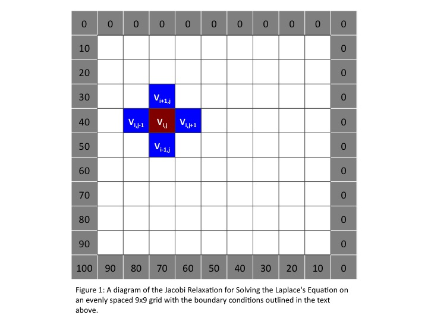

### Background

The algorithm used in this program solves Laplace’s equation on an
evenly spaced grid through the use of a simple Jacobi iteration
technique. The equation is a partial differential equation named after
Pierre-Simon Laplace and are important in many fields of science: namely
the fields of electromagnetism, astronomy and fluid dynamics. The
physical interpretation of the equations is they describe the behavior
of potentials.

The equation has the form:


A practical solution to this equation is the use of a Jacobi iteration
that employs numerical second derivatives. Lets assume that we would
like to know the state of heat flow across a metal surface where the
source is coming from one of the corners of the square surface.

To tackle this, we would set up a two dimensional grid to represent the
surface, and we will divide it evenly into square regions. We can
simulate the heat source by defining the boundary conditions along the
sides of the grid. In this case, we will be setting the bottom left
corner to 100.0 and with an increasing gradient toward the other corners
until it is zero. Once these conditions are set, the algorithm will use
numerical solutions to the second derivatives in each direction to
update the current matrix elements. And although we won’t check for
convergence, the flow of the surface will eventually hit a
steady-state.


**Your final goal is to produce a .gif picture very similar to the one we used in bash/gnuplot 2d exercise**

### The Algorithm and code structure


1.  Create a CMesh class to store the grid (templated on a type of data). Put this class into a separate header (inside `include` folder).
    You will need 3 fields in this class:
    - the size (in one dimension, the grid should be square)
    - 2 std::vectors - `field` and `new_field` (keep reading to know why you need 2 of them)

    You need to leave space for the boundaries,
    as "by logic" they do not belong to the main grid (i.e. a 1024 x 1024 matrix
    would need to actually be 1026x1026).

2.   The above class needs to have a constructor and a print function (you don't actually need copy/move constructors with vectors, we had them in matrix exercise for the sake of the exercise.). Everything else will be in other classes.
    You constructor should take the size as a parameter and also the function for setting up the boundary conditions. Template it on a type of the function to set them. Like this:
    
```cpp
template <typename F>
  CMesh(size_t N, F boundary_conditions)
  : {
      // RESIZE FIELDS HERE AND SET THE SIZE
     
     //set up the boundary conditions
     //even though in this toy we could just call a lambda inside the class
     // we want a more general approach in case we want to change the conditions
     boundary_conditions(field);
   }
```


3.  Write a functions to set up initial boundary conditions. It should be in a separate header file.
    The value at the lower left hand corner of the of the grid will be fixed at 100.00 (but still have it a parameter you can change), and the value ascending and to the right should be linearly approaching zero (see Figure 1). The rest of the borders are zero. 
    
    Fill in the rest of the grid with `0.5`s.
    Later in the main you will have to call the constructor of the mesh by passing this function and the template like this:

```cpp
     //you are free to name the variables something else
     CMesh<double> data(N, some_boundary_condition<double>);
```

4.  Stop implementing now and **TEST WHAT YOU ALREADY HAVE**. Create the mesh, fill it in, print it. Set some small size (like 10) to easier see that the boundary conditions have worked. Use gnuplot (matrix with image, like we already it for that .gif). Do not proceed further untill this part works.
    
5.  Write a solver class that will have the jacobi method. It needs to be in yet another header file.
    It should look something like this:

```cpp
template <typename T>
class CSolver{
public:
  void jacobi(CMesh<T>& m, const size_t& max_steps, const size_t& PrintInterval);
};
```

At each iteration (step), the value of each inner matrix element needs to be recomputed from elements of the  current iteration. The updating formula, based on numerical computation of second derivatives, is:


    Here is the visual illustration:




Be careful to not change the borders!
At the end of the iteration, you will need to swap the `field` and `new_field`. 
*Do not use copy, use `swap` for the vectors*.
You will need to print the field in the process to create the gif, but printing at every step would be too much, so choose some interval. You should be able to turn off the printing completely if needed.

6. Use a parameter file (that should be passed from command line) to store the size of the grid, the value in the corner (100) and the initial values of the field (0.5).

7.  If you haven't already done so (you should have...), write very detailed comments (in doxygen format) for each function you have. You will need it as in 2 weeks you will have forgotten everything, but you will need to parallize this code.


