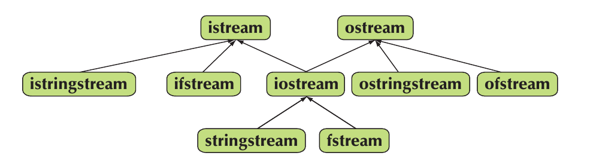

**This notes file is a collection of "random stuff" - whatever didn't fit anywhere else or was forgotten**

### Constant member functions

Usually when you don't want to modify variables, you pass them as `const` to functions. However, you don't "pass" the fields of the class to class member functions. If you want to make sure your class fields are not modifed, use `const` specifier for the function. If you then need to exclude something  - there is a `mutable` keyword.

```cpp
class CA{
public:
  int a;
  mutable int b;
  int c;
  CA(const int& a0, const int& b0, const int & c0):a(a0),b(b0),c(c0){};
  void weird_print() const;
};

void CA::weird_print()const{
  //a=9; //this won't work
  b=77;
  std::cout<<a<<" "<<b<<" "<<c<<std::endl;
}

int main(){
  CA A(1,2,3);
  A.weird_print();
}
```


### Bitwise operators

(comes from C)

#### Bitwise AND Operator: &
The bitwise AND operator & compares each bit of the first operand to the corresponding bit of the second operand. If both bits are 1, the corresponding result bit is set to 1. Otherwise, the corresponding result bit is set to 0.

```cpp
int a = 5;  // 0101 in binary
int b = 3;  // 0011 in binary
int c = a & b;  // 0001 = 1 in decimal
```

#### Bitwise OR Operator: |
The bitwise OR operator | compares each bit of the first operand to the corresponding bit of the second operand. If either bit is 1, the corresponding result bit is set to 1. If both bits are 0, the resulting bit is set to 0.

```cpp
int a = 5;  // 0101 in binary
int b = 3;  // 0011 in binary
int c = a | b;  // 0111 = 7 in decimal
```
#### Bitwise XOR Operator: ^
The bitwise XOR (exclusive or) operator ^ compares each bit of the first operand to the corresponding bit of the second operand. If the bits are different, the corresponding result bit is set to 1. Otherwise, the bit is set to 0.

```cpp
int a = 5;  // 0101 in binary
int b = 3;  // 0011 in binary
int c = a ^ b;  // 0110 = 6 in decimal
```

#### Bitwise NOT Operator: ~
The bitwise NOT operator ~ inverts the bits of its operand, converting all 1s to 0s and all 0s to 1s.

```cpp
int a = 5;  // 0101 in binary
int b = ~a;  // 1010 = -6 in decimal (two’s complement)
```

#### Bitwise Left Shift Operator: <<
The left shift operator << shifts all the bits in its left operand to the left by the number of places specified by its right operand. New bits are filled with 0s.

```cpp
int a = 5;  // 0101 in binary
int b = a << 1;  // 1010 = 10 in decimal
```

#### Bitwise Right Shift Operator: >>
The right shift operator >> shifts all bits in its left operand to the right by the number of places specified by its right operand. If the value is non-negative, new bits are filled with 0s, while if it's negative, the new bits are filled with 1s.

```cpp
int a = 5;  // 0101 in binary
int b = a >> 1;  // 0010 = 2 in decimal
```

### Ternary operator

The `?` operator (that you might have seen in ifs) is known as the ternary operator (also called the conditional operator). It's a shorthand way to perform a simple if-else statement and is used to decide which of two expressions should be evaluated, based on the result of a condition.

```
condition ? expression_if_true : expression_if_false;
```
   - condition: An expression evaluated as a boolean (true or false).
   - expression_if_true: Expression that is evaluated if condition is true.
   - expression_if_false: Expression that is evaluated if condition is false.


```cpp
#include <iostream>

int main() {
    int a = 10, b = 20;

    // Ternary operator to decide which number to print
    std::cout << (a > b ? "a is greater" : "b is greater") << std::endl;

    return 0;
}
```

In this example:

If a > b evaluates to true, the string "a is greater" is printed.
If a > b evaluates to false, the string "b is greater" is printed.


#### Usage in Assignments
You can use the ternary operator to conditionally assign a value to a variable. For instance:

```cpp
int a = 10, b = 20;

int max_val = (a > b) ? a : b; // max_val will be assigned the larger of a and b
```

Here:

If a > b is true, max_val is assigned the value of a.
Otherwise, max_val is assigned the value of b.


#### Nested Ternary Operators
Ternary operators can be nested, which means you can use a ternary operator as one of the expressions in another ternary operator. However, *this is extremely confusing*.

```cpp
int a = 10, b = 20, c = 15;

int max_val = (a > b) ? (a > c ? a : c) : (b > c ? b : c);
```


#### Enums:

Enums are one of the way to get rid of "magic numbers" when you have some set of "cases":

```cpp
#include <iostream>

enum Days {
    MONDAY,
    TUESDAY,
    WEDNESDAY,
    THURSDAY,
    FRIDAY,
    SATURDAY,
    SUNDAY
 };

enum Animals{
    CAT=3,
    DOG,
    RABBIT,
    HORSE=9,
    BEAR
};
 
int main(){
 
 // Days today = WEDNESDAY;
 Days today=SATURDAY; 
 
  if (today == WEDNESDAY) {
        std::cout << WEDNESDAY << std::endl;
  } else {
        std::cout << SUNDAY+2 << std::endl;
  }

  //works, but if values are not sequential, doesn't give what you expect
  for(int i=CAT;i<=BEAR;i++){
    std::cout<<i<<" ";
  }
  std::cout<<std::endl;
  return 0;
}

```

### Custom deleters for smart pointers

*Remember that you might use this when you learn cuda*

We have learned that smart pointers call destructor by themselves. However, what if you need to modify the destructor? In fact, smart pointers are templated on a "deleter" function, so you can pass that as a parameter. Here is an example:

```cpp
#include <iostream>
#include <memory>

int main() {
    // Using a lambda expression for a custom deleter
    auto deleter = [](int* p) {
        std::cout << "Destructor called\n";
        delete p;
        p=nullptr;
    };

    // Creating a unique_ptr with a custom deleter
    std::unique_ptr<int, decltype(deleter)> p(new int, deleter);

    return 0;
}
```

### Streams





You can "print to strings" and "read from strings" by using sstream:

```cpp
#include <sstream>
#include <iostream>

int main( int argc, char *argv[] ){
  std::istringstream ss(argv[1]);
  int x{0};
   //let's "read" the arguments passed to the program
  //we try to read a number from the first passed argument
  if (!(ss >> x)) {
    std::cerr << "Invalid number: " << argv[1] << std::endl;
  } else if (!ss.eof()) {
    std::cerr << "There are trailing characters after the number: " << argv[1] << std::endl;
    std::cout<<"number was "<<x<<std::endl;
  }
   
  //now let's write something to a string
   //this is quite useful for file_names creation
   std::ostringstream ss2;
   ss2<<"MEOW"<<x;
   std::string result = ss2.str();
   std::cout<<result<<std::endl;
  return 0;
}


```


### Exercise1:

Change your "converstion to binary and back" exercise using bitwise operations.

### Exercise2:

Find max value of 4 numbers using ternary operator.

### Exercise3:

Convert contents of an `std::vector` to a string (use stringstreams).


