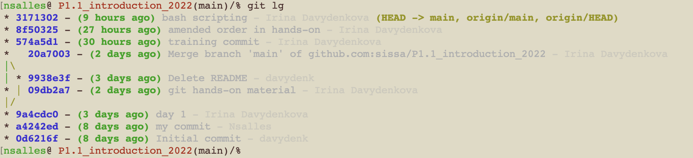

 
## Branches

Git branches allow you to diverge from the main line of development.

A branch is essentially a unique set of code changes with a unique name. 

### Why Use Branches?

- **Isolation**: Allows developers to work on features or bugs without affecting the main codebase.
- **Parallel Development**: Multiple branches can be worked on simultaneously.

### Basic Commands for Branching

#### 1. List All Branches

```bash
git branch
```
This will show you a list of all branches in your repository. The currently active branch will be highlighted and marked with an asterisk.

#### 2. Create a New Branch

```bash
git branch <branch_name>
```

This will create a new branch with the specified name.

#### 3. Switching to a Branch

```bash
git checkout <branch_name>
```

This will switch you to the specified branch, making it the active branch.

#### 4. Creating and Switching in One Command

```bash
git checkout -b <branch_name>
```

This will create a new branch and immediately switch to it.

#### 5. Deleting a Branch

```bash
git branch -d <branch_name>
```


#### 6. Merging a Branch

Once you've completed your work on a branch and it's been reviewed, you'll want to merge it into your main branch (usually called "master" or "main").

```bash
git checkout master
git merge <branch_name>
```

#### 7. Handling Merge Conflicts

Sometimes when you try to merge, you'll get merge conflicts. This happens when the same part of a file was modified in both the branch you're merging from and the branch you're merging to.

Git will mark the conflicts in the file. You'll need to manually edit the file to resolve these conflicts (open file in editor and delete what's not needed, you will see once you try). 

### Pull requests

Use this if you find a typo that I need to change in my (or later in other lecturers's) text. 

Follow a guide [here](https://docs.github.com/en/pull-requests/collaborating-with-pull-requests/proposing-changes-to-your-work-with-pull-requests/creating-a-pull-request-from-a-fork) to open a pull request.

## Day 3 starts here

### pull is actually fetch + merge

When you do 

```
git pull origin main
```

this (usually) means that the 2 following commands get executed:

```bash
git fetch origin
git merge main (here it's the remote version of "main")
```

another (non-default) option is using **rebase** instead of **merge**.

What is rebase?

Rebase will "rewrite history" and make it look "linear", as if you only ever made changes on one branch.

You will see what happens in the exercises.

*Do not use rebase unless your boss tells you to.*


#### Notice to yesterday's collaborative exercise:

If your partner created a branch and you want to have it on your computer *without any of your local changes*,
you can simply do

```
git fetch origin
git checkout YOUR_PARTNERS_BRACH
```


### Logs/history

Git provides tools to navigate and understand the history of a project. One of the most used tools for this purpose is `git log`.

To see the commit history:

```bash
git log
```

or, to have it more readable:

```
git log --oneline
```

#### Bonus

You can customise your `git log` command thanks to many options it has.
To avoid rewriting the list of options every time, you can create an alias in your `~/.gitconfig` file.
Here is an example you can find on the internet:
```
[alias]
	lg = log --graph --abbrev-commit --decorate --format=format:'%C(bold blue)%h%C(reset) - %C(bold green)(%ar)%C(reset) %C(white)%s%C(reset) %C(dim white)- %an%C(reset)%C(bold yellow)%d%C(reset)' --all
``` 
The result should look like this:



### Creating branches from the old commits

Sometimes might want to return to the past and see how things could have played differently. With git you can!

Just do 

```
git checkout -b time_travel_branch <commit-hash>
```

This will also allow you to do "correct" pull requests between forks.


### When you messed up

#### Using git revert 

The "git revert" command creates a new commit that undoes the changes made in the unwanted commit. 

```bash
git revert <commit-hash>
```

(you get commit hash from the log)

Push the New Reverting Commit:

```bash
git push origin <branch-name>
```

This will keep your history untouched, and also record your reverting things. It's better if you want to avoid confusion, but some people don't like extra records in history and only use "git reset".


# git reset (Use with caution)

The git reset command moves the current branch pointer to the specified commit, essentially discarding commits. This method rewrites commit history, which can be problematic if others are working on the same branch. On the bring side, it has more options.


```bash
git reset --hard HEAD~1
```

This command moves the current branch pointer back by one commit (HEAD~1). If you need to undo multiple commits, replace 1 with the number of commits you want to go back.

Then you need to force push the updated Branch:

```bash
git push origin <branch-name> --force
```

The --force flag forces the push, overriding the changes on the remote with your local changes. Use this with caution, as it can overwrite changes made by others.

There are 3 options you can pass:

 - "--hard" : this will undo the commit and undo any changes you did since last commit
 - "--mixed" (default): will undo the commit and "staging" (i.e. undo "git add"), but leave your working changes
 - "--soft": will only undo the commit, but leave the result of "git add"


### When you messed up so much that the above doesn't help

If you

 - did reset --hard and lost changes that you actually need
 - deleted a branch you need
 - forced pushed something very wrong
 - messed things up while rebasing
 - did something else strange that now looks like you lost data

you cannot use revert or reset because your "git log" doesn't show the true history anymore. But you can get more information from a "private"/local command that is just stored on your computer and records every history change

```
git reflog
```

Here you can see hashes of the lost things and then you can reset or (better, cause you are already too deep into the mess to reset again) create a new branch from it.


## Exercises:

### Exercise 0:

Create a branch "development" (from main). Create and edit the file in development, add, commit, push.

Create a branch "new_branch" (from main again). Create and edit the file with the same name in new_branch, add, commit, push.

Now try, while being in new_branch,

`git pull origin development`

What happens?

### Exercise 1:
 Create a short markdown guide written in markdown (based, for example, on [this](https://www.markdownguide.org/basic-syntax/)). The guide should include the following topics: italics and bold text, header sizes, inserting code (both in-line and big blocks), inserting pictures, inserting links, making bullet lists. For the purpose of exercising you should do the following:


    - create a branch (in your fork) called "development". 
    - List all the mentioned topics (as headers) in the `mdguide.md` file and push it to "development".
    - From "development" create a branch for the first topic. Switch to that branch. 
    - Add and push the text. Merge the branch to development. 
    - Repeat for all topics. 
    - Open a pull request to merge development into the main branch, accept it.

### Exercise 2:

Work in pairs (one group will have 3 ppl). One of you should create a new, separate (probably private) repository and invite the other person. Repeat exercise 1, but divide the branches between the two of you.


### Exercise 3: redo this with your newfound knowledge on how to create branches with past commits

Let's practice pull requests. I have a file "for_pull_requests_training.txt" with your names. Add any number on the line with your name. Then open a pull request. Your pull request should only change 1 line in 1 file. (Now you can all use this trick to open pull requests about my typos in the future.)

### Exercise 4: 
 Our goal is to (finally) understand what happens when you merge or rebase by looking at the history. Do all this on some new private repository so that you don't clutter your class fork with total rubish. (It's actually good to have some repository for small tests/experiments and storing random files, so create something like "my_tests".)
 
 - on your new repository, create a development branch. On it, create a few (2-3) commits to main, for example, you can create new files or modify some file (you don't even have to push, you can as well work locally). Switch back to main.
 - while on main, also create a few commits.
 - merge development into main.
 - look at the log (you can use the fancy graph command or just "git log --oneline --graph"). You should see a kind of loop.
 - repeat the steps with creating 2-3 commits on both branches. 
 - this time, go into development and do "git rebase main".
 - switch to main and look at the log again. You should see that there is no loop for the latest commits.


### Exercise 5:
 Work on the same repository from exercise 4.

 - create a file "wrong_file.txt" and push it
 - undo the change with revert. Push. Check that now you don't have the file online anymore. Look at the log to see what happened. Do you have the file locally?
 - create a file "wrong_file2.txt" and push it
 - undo the change with reset. Push (you will need to use --force). Look at the log again. Do you have the file locally?
 - do the "git reset --hard" to the initial commit of your repository. Now find a way to get evrything back.


